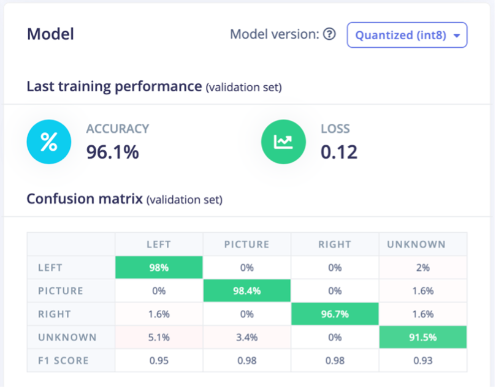
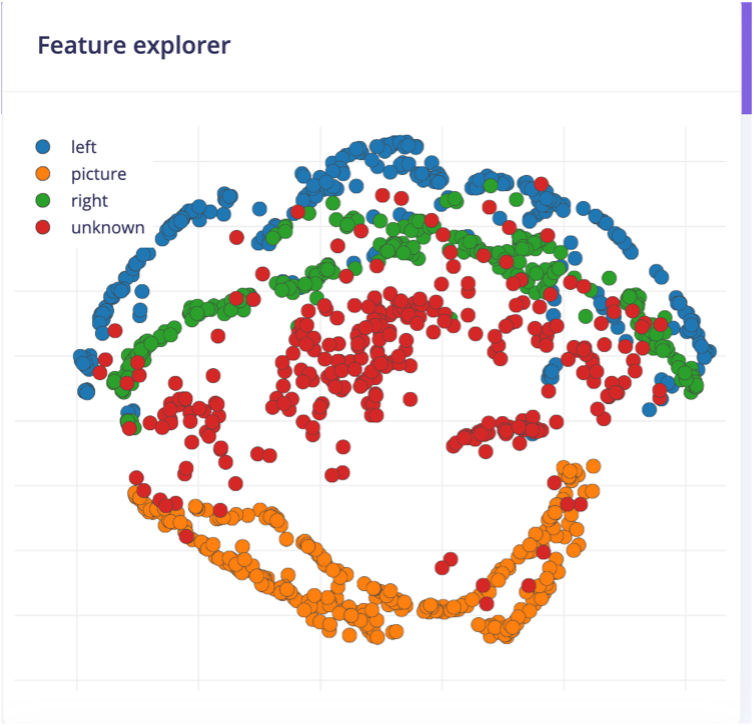

# Photo_Assistant
name: Ying Wu

Edge Impulse projects:https://studio.edgeimpulse.com/studio/680069

# Introduction
## Overview
This project is a voice-controlled photo assistant system based on keyword detection. A deep learning model is trained on the Edge Impulse platform and deployed to an Arduino Nano 33 BLE to recognize specific voice commands. The system’s primary functions are: first, triggering the camera shutter when the keyword “picture” is detected; and second, controlling the rotation direction of a servo motor based on the “left” and “right” commands. To simplify the prototype development, the actions are indicated through the onboard LEDs instead of actual hardware movement — the red LED lights up for taking a picture, the green LED indicates the servo turning left, and the blue LED indicates the servo turning right.
## Inspiration
In everyday life, I often find it inconvenient to take photos in certain situations. For example, holding a heavy phone with one hand for an extended period can be tiring, and it can be difficult to reach the shutter button. During group photos, someone usually has to hold the phone, making it hard for them to naturally be part of the picture, or the angle and distance constantly need to be adjusted. These situations can lead to missing many wonderful moments, which can be frustrating. Therefore, I wanted to design a voice-controlled photography device that allows users to take photos with simple voice commands, completely freeing up their hands.
## Research question
How to achieve hands-free photography control through sound recognition based on deep learning methods.

# Application overview
This application can be divided into three main stages:
1. Data Collection:
The built-in PDM microphone of the Arduino Nano 33 BLE Sense Board was used to collect audio data at a sampling rate of 16 kHz. Four labels were defined: picture, left, right, and unknown. Each audio sample was segmented into 1-second windows to standardize the input length for model training.
2. Model Training:
Data preprocessing and model training were performed on the Edge Impulse platform. A one-dimensional convolutional neural network (1D CNN) was used to perform keyword classification. Through multiple rounds of experimentation, various model parameters were tested to identify the most suitable configuration for the task.
3. Deployment:
The trained model was deployed onto the Arduino Nano 33 BLE board for real-time keyword detection. The microcontroller was then programmed to trigger the corresponding LED indicators based on recognized commands, allowing for functional testing and validation of the system’s performance.
## Data
data sources
To reduce errors, audio data was collected using two methods: a smartphone microphone and the built-in microphone on the Arduino board. The smartphone microphone allowed for faster and more convenient data collection, while the Arduino microphone provided samples that were closer to real-world application scenarios. Additionally, to increase the diversity of the dataset, the recordings were made by people of different nationalities, ages, and genders. Their variations in speech rate and pronunciation habits helped improve the model’s accuracy and robustness. Audio samples included the three target keywords — “picture,” “left,” and “right” — as well as various random words from everyday conversation.
data processing
A total of four labels were set: “picture,” “left,” “right,” and “unknown.” To minimize the impact of background noise, the recorded audio samples were split into 1-second segments. It is important to note that Edge Impulse Studio provides an automatic segmentation feature. However, during practical use, I found that automatic segmentation was sometimes not completely accurate and could miss parts of a word, so manual verification was necessary. 
Below are the spectrograms of the four labels. 
dataset
The total duration of the dataset is 24m 9s, with the training set lasting 19m 20s and the testing set lasting 4m 49s, resulting in an approximate 80/20 train/test split. This dataset is relatively balanced, with a similar number of samples for each label. 
## Model
Based on keyword recognition, this project adopts a 1D convolutional neural network (1D CNN) model. The model architecture is shown below.
1. Input layer: Receives a 650-dimension MFCC vector and reshapes it into a 50 × 13 time-frequency matrix for the convolutional network to process.
2. First convolutional module: Eight 1-D convolution filters (kernel width = 3) followed by max-pooling, halving the time axis while ReLU extracts short-term spectral features. 
3. Dropout 0.25: Randomly deactivates 25 % of the channels to reduce over-fitting on local patterns. 
4. Second convolutional module: Sixteen 1-D convolution filters (kernel width = 3) plus max-pooling, further compressing the time axis and learning higher-level time-frequency patterns. 
5. Dropout 0.25: Applies another round of random masking on deeper features to improve generalization.
6. Output layer: Flattens the features into a 208-dimension vector, then uses a softmax layer to output probabilities for four classes (“left”, “picture”, “right”, “unknown”). 
## Experiments
At the early stage of the project, five labels were defined: “left,” “right,” “picture,” “unknown,” and “noise.” The “noise” label was used to collect various types of background sounds, such as conversations, wind, and keyboard typing, to enhance the model’s robustness against environmental noise. During training, the model achieved approximately 95.1% accuracy, suggesting good performance. However, when deployed on the Arduino Nano 33 BLE Sense board for real-world testing, it became apparent that the device struggled to accurately recognize the “picture” keyword. Most inputs were incorrectly classified as “noise.”
Upon analysis, it was suspected that although adding a “noise” class theoretically improved noise resilience, the wake word samples themselves often contained background noise. This led the model to mistakenly classify actual keywords as “noise” during inference, significantly impacting recognition performance.
To address this issue, the “noise” label was later removed, retaining only four classes: “left,” “right,” “picture,” and “unknown.” With this adjustment, the model maintained a training accuracy of around 95.3%. More importantly, real-world testing on the Arduino board showed a noticeable improvement in correctly recognizing the “picture” keyword, greatly enhancing system accuracy under real conditions.

parameter adjustment
1. Auto-weight classes
After enabling “Auto-weight classes,” Edge Impulse automatically adjusted the loss function weights based on the number of samples in each class. This allowed minority classes, such as “left” and “right,” to have comparable influence during training as the majority class. Previously, with uniform class weights, the model tended to favor the most represented class, “unknown,” resulting in an overall accuracy of only 95.3%. After applying automatic class weighting, the impact of minority classes was amplified, leading to improved recall for those classes and raising the overall accuracy to 96.1%.
2. Number of training cycles
While keeping all other parameters constant, the number of training epochs was adjusted to evaluate its impact on model performance. The best results were achieved at 100 epochs, yielding an accuracy of 96.1%. At 90 epochs, the model reached 95.3% accuracy, likely due to underfitting, as the training loss was still decreasing and the model had not yet fully converged. On the other hand, increasing to 110 epochs resulted in a slightly lower accuracy of 95.7%, which may be attributed to overfitting.
3. Learning rate
While keeping all other parameters fixed, the learning rate was adjusted to observe its impact on training performance. A learning rate of 0.005 produced the best results, with an accuracy of 96.1%. When the learning rate was set to 0.001, the accuracy dropped slightly to 95.7%, likely due to slower convergence caused by smaller parameter update steps. In contrast, increasing the learning rate to 0.008 resulted in a significantly lower accuracy of 93.1%, possibly because the updates were too large, causing the model to oscillate around the optimal loss instead of converging smoothly.

# Results and Observations
## Result
The trained model achieved a high accuracy of 96.1% with a low loss of 0.12, and even on the test set, it maintained an impressive accuracy of 95.5%. This demonstrates the model’s strong ability to distinguish between different types of sounds in real-world environments.

The confusion matrix shows that the three target classes are generally well separated, indicating clear distinctions between the keywords. Although some overlaps and misclassifications exist, they do not significantly affect the overall training outcome or system performance.

## Limitations
During the first deployment to the Arduino board, the device consistently failed to recognize the wake words, which resulted in a significant amount of time spent debugging and searching for the cause. Attempts to improve performance by removing the “noise” label and even other wake word labels did not resolve the issue. Eventually, it was suspected that the problem stemmed from a mismatch in recording devices—training data had been collected using a smartphone, while inference was performed using the Arduino’s onboard microphone. This discrepancy led to poor model performance in real-world testing.
 To address this, a new dataset was collected using the Arduino itself, followed by retraining the model. However, data collection with the Arduino was highly inconvenient, as each recording could only capture about 6 seconds of usable audio, and the upload speed was very slow. As a result, much of the available time was spent on re-collecting data, leaving little opportunity to troubleshoot the camera module connection.
## Future improvement
1. Gather more data to improve the dataset.
2. Combine an Arduino Nano 33 BLE camera with a servo motor and design a custom enclosure.
## Bibliography
1. Edgeimpulse.com. (2024). Arduino Nano 33 BLE Sense | Edge Impulse Documentation. [online] Available at: https://docs.edgeimpulse.com/docs/edge-ai-hardware/mcu/arduino-nano-33-ble-sense.
2. Edgeimpulse.com. (2025). Keyword spotting | Edge Impulse Documentation. [online] Available at: https://docs.edgeimpulse.com/docs/tutorials/end-to-end-tutorials/audio/responding-to-your-voice [Accessed 29 Apr. 2025].
## Declarations
I, Ying Wu, confirm that the work presented in this assessment is my own. Where information has been derived from other sources, I confirm that this has been indicated in the work.
Word Count: 1500 words
